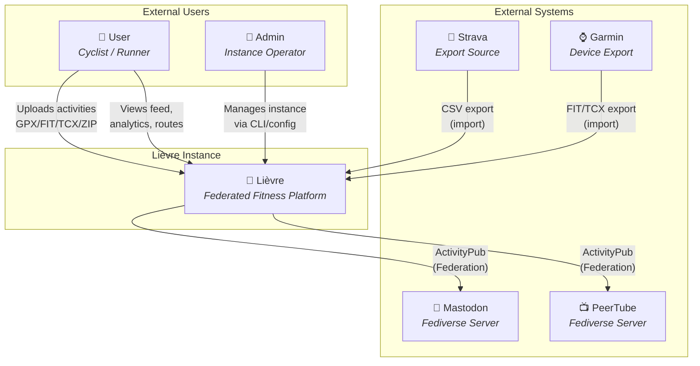
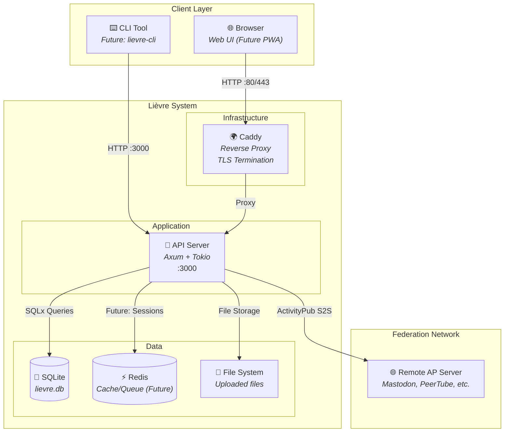
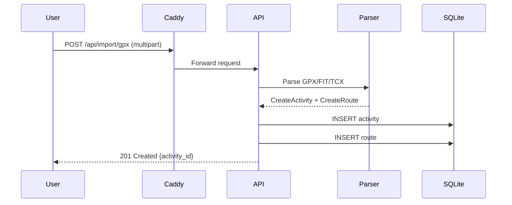
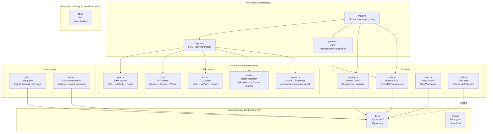
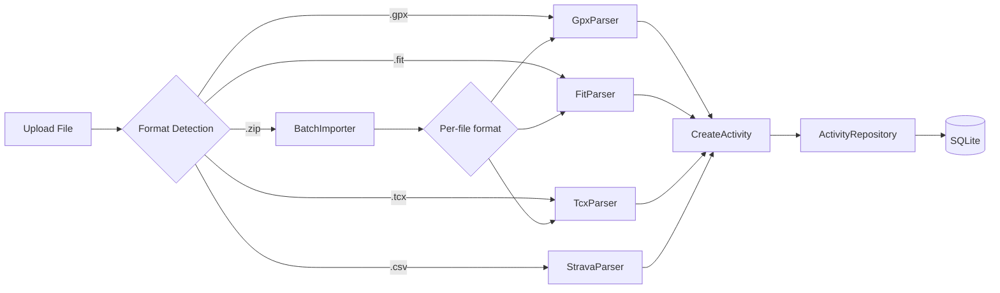
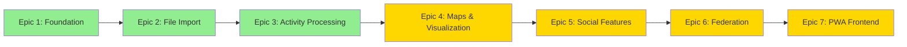

# Lièvre C4 Architecture Model

This document describes the current architecture using the [C4 model](https://c4model.com/) — four levels of abstraction for software architecture.

**Current State:** Epic 1 (Foundation) + Epic 2 (File Import) + Epic 3 (Activity Processing) complete.

---

## Level 1: System Context

The big picture — who uses Lièvre and what it connects to.



### Key Relationships

| Relationship | Protocol | Description |
|-------------|----------|-------------|
| User → Lièvre | HTTP/HTTPS | REST API for activity upload, viewing, management |
| Lièvre → Mastodon/PeerTube | ActivityPub S2S | Federate exercises to followers across instances |
| Strava/Garmin → Lièvre | File Import | Users export data and upload to Lièvre |

---

## Level 2: Container Diagram

The high-level technical building blocks inside Lièvre.



### Container Responsibilities

| Container | Technology | Purpose |
|-----------|------------|---------|
| **Caddy** | Go, Docker | Reverse proxy, automatic TLS, static file serving |
| **API Server** | Rust, Axum, Tokio | REST API, file import, business logic, federation |
| **SQLite** | SQLite 3 | Persistent storage for users, activities, routes |
| **Redis** | Redis 7 | Session cache, job queue (not yet integrated) |
| **File System** | Host mount | Stored GPX/FIT/TCX files, future map tiles |

### Data Flow: Activity Import



---

## Level 3: Component Diagram

Inside the API Server — the core components we've built.



### Component Details

#### Domain Components

| Component | File | Responsibilities | Dependencies |
|-----------|------|------------------|--------------|
| **Activity** | `activity.rs` | CRUD operations, type filtering, user scoping | SQLite via SQLx |
| **Route** | `route.rs` | GeoJSON LineString storage, coordinate management | SQLite via SQLx |
| **User** | `user.rs` | User model, email/username lookup | SQLite via SQLx |
| **Auth** | `auth.rs` | JWT generation/validation, password hashing | argon2, jsonwebtoken |

#### File Import Components

| Component | File | Input Format | Output | Dependencies |
|-----------|------|--------------|--------|--------------|
| **GpxParser** | `gpx.rs` | `.gpx` (XML) | CreateActivity + CreateRoute | quick-xml |
| **FitParser** | `fit.rs` | `.fit` (Binary) | CreateActivity + CreateRoute | fitparser |
| **TcxParser** | `tcx.rs` | `.tcx` (XML) | CreateActivity + CreateRoute | quick-xml |
| **BatchImporter** | `batch.rs` | `.zip` | Vec\<ParsedActivity\> | zip crate |
| **StravaParser** | `strava.rs` | `.csv` | Vec\<StravaActivity\> | csv crate |

### Internal Data Flow



---

## Level 4: Code (Current Implementation)

The actual module structure and key interfaces.

```
lievre/
├── Cargo.toml              # Workspace root
├── docker-compose.yml      # Container orchestration
├── Dockerfile              # Multi-stage Rust build
├── crates/
│   ├── api/                # HTTP layer (Axum)
│   │   └── src/
│   │       ├── main.rs     # Server entry, routing
│   │       └── import.rs   # GPX upload endpoint
│   ├── core/               # Business logic
│   │   └── src/
│   │       ├── lib.rs      # Module re-exports
│   │       ├── activity.rs # Activity model + repo
│   │       ├── route.rs    # Route model + GeoJSON
│   │       ├── user.rs     # User model
│   │       ├── auth.rs     # JWT authentication
│   │       └── import/
│   │           ├── mod.rs  # Parser exports
│   │           ├── gpx.rs  # GPX parser
│   │           ├── fit.rs  # FIT parser
│   │           ├── tcx.rs  # TCX parser
│   │           ├── batch.rs # Batch importer
│   │           └── strava.rs # Strava CSV
│   ├── shared/             # Common utilities
│   │   └── src/
│   │       ├── db.rs       # SQLite pool, migrations
│   │       └── error.rs    # Error types
│   └── federation/         # ActivityPub (placeholder)
│       └── src/
│           └── lib.rs      # Stub
```

### Key Interfaces

```rust
// Activity Repository
pub struct ActivityRepository { pool: SqlitePool }
impl ActivityRepository {
    pub async fn create(&self, user_id: &str, activity: CreateActivity) -> Result<Activity>;
    pub async fn find_by_id(&self, id: &str) -> Result<Option<Activity>>;
    pub async fn find_by_user(&self, user_id: &str) -> Result<Vec<Activity>>;
    pub async fn delete(&self, id: &str) -> Result<()>;
}

// File Parsers (trait-like pattern)
pub struct GpxParser;
impl GpxParser {
    pub fn parse(&self, content: &str) -> Result<ParsedGpx>;
    pub fn to_create_activity(&self, gpx: &ParsedGpx) -> CreateActivity;
    pub fn to_create_route(&self, activity_id: &str, gpx: &ParsedGpx) -> CreateRoute;
}
```

---

## Technology Decisions

| Decision | Choice | Rationale | Trade-off |
|----------|--------|-----------|-----------|
| Language | **Rust** | Performance, safety, type-safety | Steeper learning curve |
| Web Framework | **Axum** | Tower-based, async, good ergonomics | Less mature than Actix |
| Database | **SQLite** | Zero-config, single-file, great for dev | Limited concurrency at scale |
| XML Parsing | **quick-xml** | Fast, low memory, event-based | SAX-style (not DOM) |
| FIT Parsing | **fitparser** | Garmin-compatible, serde-based | Limited documentation |
| Federation | **activitypub-federation** | Battle-tested by Lemmy | Adds complexity |

---

## What's Built vs. What's Planned

### ✅ Built (Epic 1 + 2 + 3)

| Layer | Status | Components |
|-------|--------|------------|
| Database | ✅ SQLite | Pool, migrations, CRUD tables, jobs, stats |
| Auth | ✅ Local | Register, login, JWT |
| Activities | ✅ CRUD | Create, read, delete |
| Routes | ✅ Storage | GeoJSON, coordinates |
| Import | ✅ Multi-format | GPX, FIT, TCX, ZIP, Strava CSV |
| Processing | ✅ Background | Job queue with retry, stats computation |
| API | ✅ REST | Health, import, GeoJSON endpoint |

### 🔨 Not Yet Built

| Layer | Status | Components |
|-------|--------|------------|
| Federation | 🔲 Stub | ActivityPub C2S/S2S, WebFinger |
| Social | 🔲 Planned | Follow, like, comment |
| Analytics | 🔲 Planned | Stats, PRs, charts |
| Frontend | 🔲 Planned | React PWA, maps, charts |
| Background Jobs | 🔲 Planned | Async processing, queue |
| Gear Tracking | 🔲 Planned | Equipment management |

---

## Evolution Path



| Epic | Focus | Key Deliverables |
|------|-------|------------------|
| **1** ✅ | Foundation | DB, Auth, API scaffold |
| **2** ✅ | File Import | GPX/FIT/TCX parsers, batch import |
| **3** ✅ | Activity Processing | Stats computation, job queue, GeoJSON |
| **4** | Maps & Visualization | Leaflet maps, elevation charts |
| **5** | Social Features | Follow, like, comment, feed |
| **6** | Federation | ActivityPub, WebFinger, federation with Mastodon |
| **7** | Frontend PWA | React app, offline support |

---

*Last updated: 2026-08-10*
